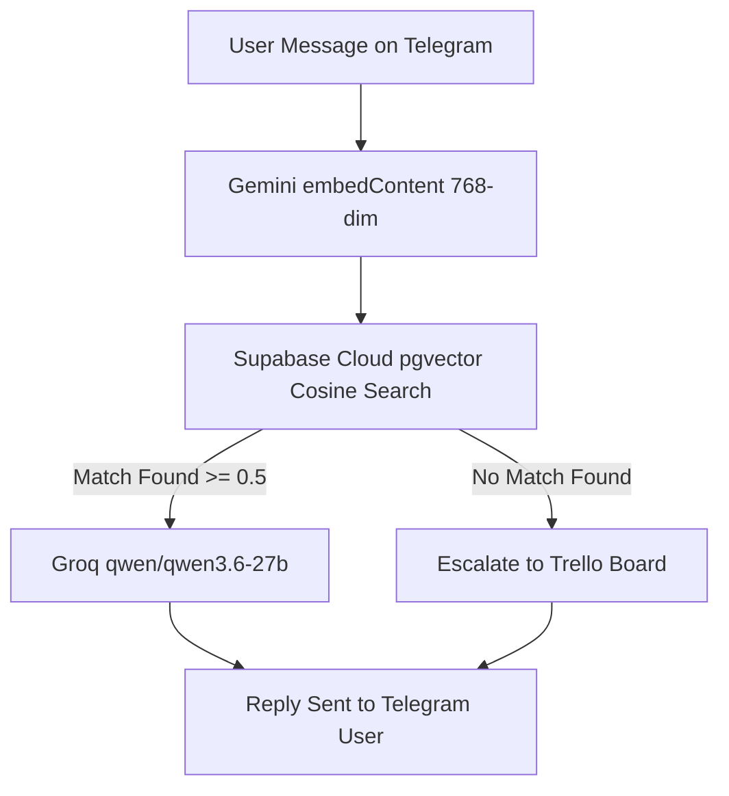

# Nivaran AI — Intelligent Customer Support Agent

Nivaran AI is a Retrieval-Augmented Generation (RAG) Customer Support Bot powered by **Node.js**, **Telegram Bot API**, **Google Gemini Embeddings**, **Supabase Cloud PostgreSQL with pgvector**, **Groq LLM (`qwen/qwen3.6-27b`)**, and **Trello Escalation**.

---

## 🚀 Key Features & Architecture

1. **Vector Embeddings**: Uses Gemini API (`gemini-embedding-001`) configured with 768 dimensions.
2. **Cloud Vector Database**: Stores knowledge embeddings in **Supabase Cloud PostgreSQL** using the native `pgvector` extension.
3. **Similarity Search**: Performs cosine distance vector similarity queries directly in Supabase PostgreSQL.
4. **LLM Text Generation**: Generates contextual responses using Groq SDK (`qwen/qwen3.6-27b`).
5. **Human Escalation**: Automatically creates Trello support tickets when the knowledge base has no matching information.
6. **Telegram Integration**: Long Polling mode (`polling: true`) requires zero webhook tunnel software (no `ngrok` or `localtunnel` required).

---

## 🛠️ Prerequisites

Before running the project, make sure you have installed:

- **Node.js** (v18 or higher)
- **Supabase Account & Project** with `pgvector` enabled
- **Telegram Account** (to create your bot via `@BotFather`)

---

## 📋 Step-by-Step Setup Guide

### 1. Extract & Navigate to Project Folder
Open your terminal in the `Nivaran_Ai` folder:
```bash
cd Nivaran_Ai
```

---

### 2. Configure Environment Variables (`.env`)
Create or verify your `.env` file in the root directory of `Nivaran_Ai`:

```ini
PORT=3000

# Google Gemini API Key
GEMINI_API_KEY=your_gemini_api_key_here

# Groq API Key
GROQ_API_KEY=your_groq_api_key_here

# Telegram Bot Token (obtained from @BotFather)
TELEGRAM_BOT_TOKEN=your_telegram_bot_token_here

# Supabase Cloud Database URL
DATABASE_URL=postgresql://postgres.[project-ref]:[password]@[pooler-host]:6543/postgres
SUPABASE_URL=https://your-project-ref.supabase.co
SUPABASE_ANON_KEY=your_supabase_anon_key_here

# Trello Integration (Optional / For Escalation)
TRELLO_API_KEY=your_trello_api_key
TRELLO_TOKEN=your_trello_token
TRELLO_BOARD_ID=your_trello_board_id
```

---

### 3. Install Node.js Dependencies
Install all required npm packages:

```bash
npm install
```

---

### 4. Ingest Knowledge Base Data (Seed Supabase Database)
Run the seed script to generate vector embeddings for sample knowledge documents and store them in Supabase PostgreSQL:

```bash
node seed.js
```

*Expected output:*
```text
Starting data ingestion...
✅ Seeded: "Our store hours are Monday through Frida..."
✅ Seeded: "Returns and refunds are accepted within ..."
✅ Seeded: "We offer free shipping on all orders ove..."
✅ Seeded: "You can track your order by logging into..."
Done! Knowledge base is ready.
```

---

### 5. Create Your Telegram Bot (30 Seconds)
1. Open Telegram and search for **`@BotFather`**.
2. Send **`/newbot`**.
3. Provide a Name (e.g. `Nivaran AI`) and a Username (e.g. `NivaranAiBot`).
4. Copy the API Token provided by BotFather and paste it into your `.env` file as `TELEGRAM_BOT_TOKEN`.

---

### 6. Run the Nivaran AI Agent
Start the bot application:

```bash
node index.js
```

*Expected output:*
```text
🚀 Nivaran AI Telegram Bot started and listening for messages!
```

---

### 7. Interact with the Bot
1. Open your bot on Telegram.
2. Click **`/start`**.
3. Send any query (e.g., *"What are your store hours?"* or *"How can I track my order?"*).
4. Watch real-time logs in your terminal as the AI responds!

---

## 📁 Directory Structure

```text
Nivaran_Ai/
├── migrations/
│   └── 01_init.sql        # Database initialization script (vector extension & schema)
├── .env                   # Environment credentials configuration
├── index.js               # Main Telegram bot application & RAG execution logic
├── seed.js                # Supabase database ingestion & vector embedding script
├── package.json           # Node.js dependencies
└── README.md              # Project setup documentation
```

---

## ⚙️ How RAG Workflow Works


